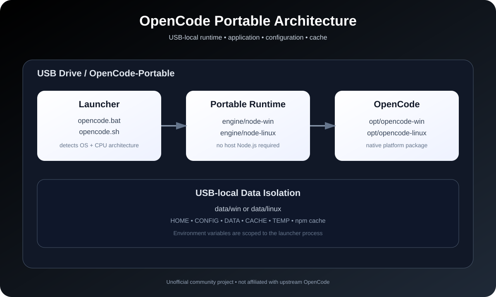

# OpenCode Portable 🚀

<p align="center">
  
  
  
  
</p>

<p align="center">
  <strong>Run OpenCode from a USB drive without installing Node.js or OpenCode on the host.</strong>
</p>

<p align="center">
  <em>Unofficial community project — not affiliated with the upstream OpenCode project.</em>
</p>

<p align="center">
  
</p>

---

## ✨ What is OpenCode Portable?

OpenCode Portable packages the runtime, OpenCode application, configuration, cache, sessions and temporary working data into a USB-local directory structure.

The goal is simple:

> **Carry your AI coding environment with you. Plug in the USB. Launch. Work.**

No host Node.js installation is required. No administrator/root privileges are required for normal operation. Windows and Linux launchers automatically detect the CPU architecture and use the corresponding native OpenCode package.

### Core capabilities

- 💾 **USB-first** — application and user data live on the removable drive
- 🪟 **Windows support** — x64 and ARM64
- 🐧 **Linux support** — x64 and ARM64 on compatible glibc-based systems
- 🧩 **Portable Node.js** — host Node.js is not required
- 🔐 **Download integrity checks** — downloaded runtime/application artifacts are verified
- 📦 **Native OpenCode binaries** — launches the platform binary directly instead of depending on a host-global installation
- ⚙️ **Session-local environment** — launcher-scoped environment variables keep application data in the portable tree
- 🔁 **Version pinning** — use `OPENCODE_VERSION` when reproducibility matters
- 🧪 **CI smoke testing** — Windows launcher behavior is covered by GitHub Actions

---

## 🏗️ Architecture

The portable workspace is divided into three layers:

```text
OpenCode-Portable/
│
├── opencode.bat              # Windows launcher
├── opencode.sh               # Linux launcher
│
├── engine/                   # Portable runtimes
│   ├── node-win/
│   └── node-linux/
│
├── opt/                      # Portable application
│   ├── opencode-win/
│   └── opencode-linux/
│
└── data/                     # USB-local user/application data
    ├── win/
    │   ├── home/
    │   ├── config/
    │   ├── share/
    │   ├── cache/
    │   ├── temp/
    │   └── npm-cache/
    │
    └── linux/
        ├── home/
        ├── config/
        ├── share/
        ├── cache/
        ├── temp/
        └── npm-cache/
```

### Runtime isolation

A private Node.js runtime is downloaded to `engine/` on first run. This means the portable workspace does not depend on the version of Node.js installed on the host.

### Application isolation

OpenCode is installed into `opt/` using the platform-specific native package. The launcher resolves the binary from the USB-local application tree.

### Data isolation

The launcher redirects application-related paths such as:

- `HOME` / `USERPROFILE`
- `APPDATA` on Windows
- `XDG_CONFIG_HOME`
- `XDG_DATA_HOME`
- `XDG_CACHE_HOME`
- `TEMP` / `TMPDIR`
- `NPM_CONFIG_CACHE`

These variables are scoped to the launched process/session and are not permanently added to the host environment.

---

## 💻 Supported Platforms

| Platform | CPU | Status |
|---|---|---|
| Windows 10+ | x64 | ✅ Supported |
| Windows 10+ | ARM64 | ✅ Supported |
| Linux | x64 / glibc | ✅ Supported |
| Linux | ARM64 / glibc | ✅ Supported |
| Linux / musl (Alpine etc.) | x64 / ARM64 | ⚠️ Not currently guaranteed |
| macOS | x64 / ARM64 | ❌ Not currently supported |

> **Linux note:** some removable-media mounts use `noexec`, which prevents executing binaries directly from the USB filesystem. If this happens, mount the drive with execution enabled or use an appropriate executable filesystem/partition.

---

## 🚀 Quick Start

### 1. Prepare the USB drive

**exFAT** is recommended when the same drive needs to be shared between Windows and Linux.

### 2. Copy the project

Copy the `OpenCode-Portable` directory to the USB drive.

### 3. Launch

#### Windows

```bat
cd E:\OpenCode-Portable
opencode.bat
```

Or simply double-click:

```text
opencode.bat
```

#### Linux

```bash
cd /media/$USER/OPENCODE/OpenCode-Portable
chmod +x opencode.sh
./opencode.sh
```

### First run

The launcher will:

1. Detect operating system and CPU architecture.
2. Download the required portable Node.js runtime.
3. Verify the Node.js download.
4. Resolve/download the platform-specific OpenCode package.
5. Verify the OpenCode package integrity.
6. Store the installation under `engine/` and `opt/`.
7. Configure USB-local application paths.
8. Launch OpenCode.

**Internet access is required for the initial download unless the required runtime/application artifacts are already present on the USB.**

Subsequent launches reuse the local installation.

---

## 🔐 Integrity & Reproducibility

The launcher is designed to verify downloaded artifacts before using them.

### Node.js

The Node.js archive is checked against the published SHA-256 checksum before extraction.

### OpenCode

The platform package metadata and tarball integrity are checked using npm registry metadata/SRI before installation.

### Pin a version

For reproducible deployments, pin OpenCode instead of using the moving `latest` tag.

#### Linux

```bash
OPENCODE_VERSION=<version> ./opencode.sh
```

#### Windows Command Prompt

```bat
set OPENCODE_VERSION=<version>
opencode.bat
```

Example:

```text
OPENCODE_VERSION=1.2.3
```

Use an actual version published by the upstream project; the example above is illustrative.

> **Recommendation:** production USB builds should pin both the OpenCode and Node.js versions rather than depending on moving `latest` artifacts.

---

## 📁 Data & Configuration

All portable application data is organized under the OS-specific `data/` directory.

| Data | Windows | Linux |
|---|---|---|
| Home | `data\win\home\` | `data/linux/home/` |
| Config | `data\win\config\` | `data/linux/config/` |
| Shared data | `data\win\share\` | `data/linux/share/` |
| Cache | `data\win\cache\` | `data/linux/cache/` |
| Temporary files | `data\win\temp\` | `data/linux/temp/` |
| npm cache | `data\win\npm-cache\` | `data/linux/npm-cache/` |

This makes it possible to carry configuration and sessions together with the portable workspace.

---

## 🔄 Reset / Clean Install

### Reset configuration and sessions

Delete the relevant directory:

```text
data/win/
data/linux/
```

### Reinstall the application/runtime

Delete the relevant OS directories under:

```text
engine/
opt/
```

### Complete reset

Delete:

```text
engine/
opt/
data/
```

Then launch again.

---

## 🛡️ Privacy & Host-System Caveat

This project aims to keep **OpenCode/Node application data** inside the portable workspace.

It does **not** and cannot guarantee that the host operating system leaves no evidence that a program was executed from removable media.

Depending on the operating system and security configuration, the host may maintain its own telemetry, security logs, filesystem metadata, antivirus records, shell history, process information, or other OS-level artifacts.

Therefore, the accurate claim is:

> **USB-local application/data isolation — not guaranteed host-level zero trace.**

Do not use this project as a mechanism for bypassing organizational monitoring or security controls.

---

## 🧪 Verification

The repository includes a Windows smoke-test workflow under:

```text
.github/workflows/windows-smoke.yml
```

For local verification, useful checks include:

```bash
bash -n OpenCode-Portable/opencode.sh
```

On Windows, test the launcher on both supported architectures where possible.

Recommended validation matrix:

| Test | Windows x64 | Windows ARM64 | Linux x64 | Linux ARM64 |
|---|---:|---:|---:|---:|
| Launcher starts | ✅ | ✅ | ✅ | ✅ |
| Portable Node.js | ✅ | ✅ | ✅ | ✅ |
| Native OpenCode binary | ✅ | ✅ | ✅ | ✅ |
| USB-local config | ✅ | ✅ | ✅ | ✅ |
| Clean first run | ✅ | ✅ | ✅ | ✅ |
| Second run without reinstall | ✅ | ✅ | ✅ | ✅ |
| Pinned OpenCode version | ✅ | ✅ | ✅ | ✅ |

Actual compatibility can depend on the host OS version, filesystem mount options, CPU, network access and upstream package availability.

---

## 🐛 Troubleshooting

### `Permission denied` on Linux

Check whether the USB filesystem was mounted with `noexec`.

```bash
mount | grep -E 'media|run/media'
```

If appropriate for your system, remount with execution enabled.

### OpenCode binary not found

Delete the OS-specific application directory and launch again:

```text
opt/opencode-linux/
```

or:

```text
opt/opencode-win/
```

### Corrupt/incomplete download

Delete the affected temporary/cache artifact and rerun the launcher. The launcher performs integrity verification before using downloads.

### Need an offline deployment

Build/populate the USB while online first, then move the already-initialized portable directory to the offline machine. A completely fresh deployment cannot download missing artifacts without network access.

---

## 📜 Project Status

**Status: Active / Experimental portable distribution**

This repository is intended to make OpenCode easier to carry between compatible machines. It is not a replacement for the official OpenCode installation methods.

The portable layer is maintained independently and may require updates when upstream OpenCode packaging, native package names, Node.js releases, or supported platforms change.

---

## ⚖️ Upstream & Licensing

OpenCode Portable is an unofficial portable distribution built around the upstream OpenCode project.

- Upstream project: [OpenCode](https://github.com/anomalyco/opencode)
- Upstream organization: [anomalyco](https://github.com/anomalyco)
- This repository: [YogendraChukka01/Portable-Opencode](https://github.com/YogendraChukka01/Portable-Opencode)

OpenCode and its dependencies remain subject to their respective licenses. This repository's portable wrapper/documentation is provided under the MIT License in `LICENSE`.

---

## 🤝 Contributing

Contributions are welcome.

Before opening a pull request:

1. Test the launcher on the affected platform.
2. Keep paths portable and relative to the project root.
3. Avoid writing persistent configuration to the host environment.
4. Preserve download-integrity checks.
5. Update the documentation when behavior changes.

See `CONTRIBUTING.md` for repository guidelines.

---

## ⭐ Why this project?

OpenCode is powerful, but a normal installation assumes you are working on a particular machine.

This project explores a different workflow:

```text
One USB drive
      ↓
Portable runtime
      ↓
Portable OpenCode
      ↓
Portable configuration + sessions
      ↓
Your AI coding workspace
```

**Plug in → Launch → Code.**

---

<p align="center">
  <strong>Built by Yogi</strong><br>
  <sub>Build. Learn. Ship. Iterate.</sub>
</p>

<p align="center">
  
</p>
